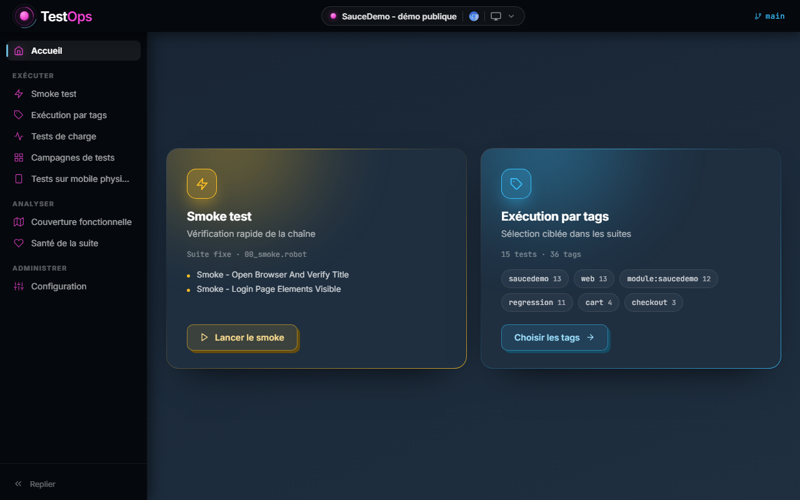
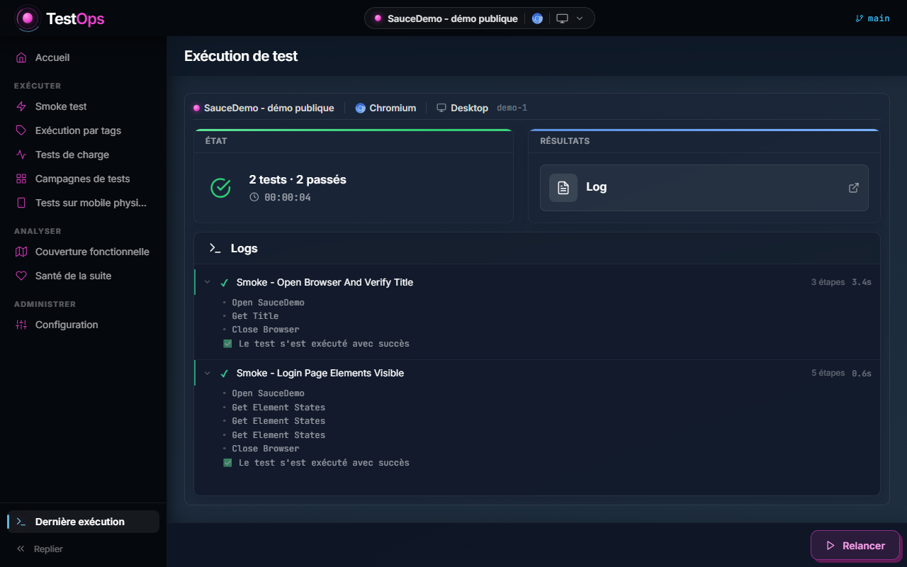

# robot-testops

Une interface web pour piloter des tests **Robot Framework** : choisir la cible, lancer une
suite, suivre les logs en direct, ouvrir le rapport. Autour du run, elle joue des campagnes
sur plusieurs cibles, des tests de charge (Locust, k6), des tests sur mobile via Appium, et
lit ce que les runs passés disent de la suite. Backend Flask + Socket.IO, frontend React,
exécution Playwright via [Browser library](https://marketsquare.github.io/robotframework-browser/).

Les suites livrées visent deux applications de démonstration publiques - **SauceDemo** et
**OrangeHRM** - et les tests de charge visent **QuickPizza**, la cible d'entraînement de
Grafana. Le dépôt s'exécute tel quel, sans compte ni serveur à fournir.

**→ [Voir l'interface en ligne](https://julien-becheny.github.io/robot-testops/)** - des runs
réels y sont rejoués : smoke, exécution par tags, lot de campagne, test de charge, run mobile,
avec leurs logs et leurs rapports. Rien n'y est exécuté : le backend est simulé, les données
viennent d'exécutions enregistrées sur une vraie installation.

[](https://julien-becheny.github.io/robot-testops/)

> Le code et la documentation sont en français, langue de travail du projet.

## Le problème qu'il résout

Robot Framework s'exécute très bien en ligne de commande. Ce qui manque, en équipe, c'est
tout ce qu'il y a autour : savoir **sur quel environnement** part un run, **ce qu'il va
jouer**, ce qui se passe **pendant**, et où est le rapport **après**. Ces informations
finissent en général dans un script maison par projet, ou dans la tête d'une personne.

TestOps les rassemble dans une interface, avec trois partis pris :

- **Aucune URL dans les tests.** Un test déclare le *module* qu'il traverse ; l'URL est
  composée à l'exécution à partir de [config/environments.yaml](config/environments.yaml).
  Changer d'environnement ne touche pas une ligne de test.
- **Aucun mot de passe versionné.** Les comptes désignent une *référence* ; la valeur vit
  dans `config/variables_config.json`, ignoré par Git.
- **Un run part d'un contexte explicite.** Navigateur, appareil émulé, environnement et
  ralenti sont visibles en haut de l'écran, figés au lancement - et un run visant une
  cible marquée `prod` demande confirmation.

## Démarrage

Prérequis : [uv](https://docs.astral.sh/uv/) et Node.js 22.12+. Python n'en fait pas partie :
uv installe la version déclarée par [.python-version](.python-version) et les versions exactes
figées par [uv.lock](uv.lock). Deux postes, ou un poste et la CI, ne peuvent pas diverger.

```bash
# uv : winget install --id=astral-sh.uv -e (Windows), brew install uv (macOS),
#      curl -LsSf https://astral.sh/uv/install.sh | sh (Linux)

# Installation (environnement .venv, navigateurs Playwright, dépendances et build du frontend)
setup.bat            # Windows
./setup.sh           # macOS / Linux

# Renseigner les mots de passe des comptes de démonstration
cp config/variables_config.json.example config/variables_config.json
```

Le fichier d'exemple liste les clés attendues. Pour les cibles publiques livrées, ce sont
les identifiants que ces sites affichent eux-mêmes sur leur page de connexion.

Deux outils restent facultatifs. [k6](https://grafana.com/docs/k6/latest/set-up/install-k6/)
n'est requis que par les tests de charge à débit imposé ; Locust, qui fait tourner les autres,
est installé par uv. Appium et son driver `uiautomator2` ne servent qu'aux tests sur mobile :
le script d'installation les pose s'ils manquent, le SDK Android reste à installer à la main.

```bash
start_testops_windows.bat     # Windows : backend + frontend
./start_testops_mac.sh        # macOS
./start_testops_linux.sh      # Linux : en arrière-plan, journaux dans temp/
```

L'interface s'ouvre sur `http://localhost:3000`, l'API écoute sur `127.0.0.1:5001`.

Sans interface, en ligne de commande :

```bash
uv run robot test_suites/web/saucedemo/00_smoke.robot
```

`uv run` choisit toujours l'environnement du projet, sans activation préalable.

## Ce que fait l'interface

| Écran | Ce qu'on y fait |
| --- | --- |
| Accueil | L'état de la chaîne : combien de tests, quelle cible, quel navigateur |
| Smoke test | Ce que le run va jouer, sur quelles combinaisons, puis on lance |
| Exécution par tags | On compose une sélection ; le nombre de tests concernés s'affiche avant de lancer |
| Tests de charge | Une cible, un profil (smoke, capacité, débit imposé...), les mesures en direct, un verdict expliqué et un rapport partageable |
| Campagnes de tests | Une matrice tests x cibles, jouée par lots : ce qui est validé ne se rejoue pas |
| Tests sur mobile physique | L'état de la chaîne Appium, puis les suites mobiles et multi-moteur sur l'appareil |
| Couverture fonctionnelle | Ce que les tests vérifient, écran par écran, et ce qu'aucun ne vérifie |
| Santé de la suite | Ce que les runs passés disent de chaque test : stable, instable ou cassé |
| Exécution | Logs en direct, chronomètre, arrêt manuel, lien vers le rapport |
| Configuration | Environnement cible, ralenti, trace Playwright |

Un run lancé continue de vivre quand on navigue ailleurs : la page d'exécution reste
montée tant qu'une session existe, et le rail affiche un badge tant qu'un run tourne.



## Organisation

```
api/            Routes HTTP fines - aucune logique métier
services/       La logique, un dossier par domaine : exécution, campagnes, charge,
                mobile, couverture, historique
core/           Chemins, configuration, environnements, registre des sessions
robot_listeners/ Listeners Robot Framework : avancement vers l'API, diagnostic de locator
libraries/      Keywords, objets de test et données, par application
functional_map/ Référentiel des écrans et fonctionnalités, source de la couverture
test_suites/    Les tests
testops/        Frontend React (Vite)
tools/          Contrôles qualité et couverture en ligne de commande
unit_tests/     Tests du backend et des services
```

Trois règles tiennent l'ensemble :

1. Les chemins passent par `core.paths.paths`, jamais en dur.
2. La configuration passe par `core.config`, jamais par `os.environ` directement.
3. Robot Framework s'exécute par `services.execution.runner.execute_rf_commands`, jamais
   par un `subprocess` isolé - c'est ce qui garantit qu'un arrêt manuel est respecté.

## Écrire un test

Un test nomme son module et ses écrans ; il ne connaît ni URL, ni mot de passe.

```robotframework
*** Settings ***
Resource       ../../../libraries/resources/web/saucedemo/kw_saucedemo.resource
Test Teardown  Close Browser
Test Tags      saucedemo  cart  web  regression

*** Test Cases ***
Cart - Add Single Item
  [Documentation]  Ajoute un article au panier et vérifie le badge.
  [Tags]  add  feat:saucedemo.panier.ajout_article
  Open And Login As  STANDARD
  Add Product To Cart  ${TO_INVENTORY}[BTN_ADD_BACKPACK]
  Get Text  ${TO_INVENTORY}[LBL_CART_BADGE]  ==  1
```

Le test ne contient ni URL ni mot de passe : `Open And Login As` résout l'URL depuis
l'environnement actif et lit le secret désigné par le compte. Les locators vivent dans
`libraries/test_objects/`, les données attendues dans `libraries/test_data/`.

Le tag `feat:` dit ce que le test **vérifie**, jamais ce qu'il traverse. Il renvoie à
[functional_map/](functional_map/), seule source qui nomme écrans et fonctionnalités :
`uv run tools/coverage.py` en tire le rapport de couverture, et `--check` refuse une
référence inconnue.

Les suites de `test_suites/multi_moteur/` vont un cran plus loin : elles sont écrites dans
un vocabulaire neutre et reçoivent leur adaptateur au lancement (`-v ACTIONS:`). Le dépôt en
livre deux, Playwright et Appium : le même test joue dans un navigateur ou sur un appareil,
sans une ligne de différence.

## Contrôles qualité

```bash
uv run tools/ci_local.py        # tout ce que joue la CI, en une commande
```

Conformité de l'environnement au verrou, tests unitaires Python, analyse statique Robot
Framework, références de couverture fonctionnelle, ESLint, tests et build du frontend, audit
des dépendances. Le workflow GitHub appelle **ce même script** : le local et la CI ne peuvent
pas diverger.

## Mettre à jour une dépendance

```bash
uv add flask==3.2.0             # écrit le pin, met à jour uv.lock et l'environnement
uv add --dev ruff==0.17.0       # outil qualité, absent de l'exécution
```

`uv add` écrit toujours une version exacte. Pour revenir en arrière :
`git checkout pyproject.toml uv.lock`, puis `uv sync`.

## Licence

MIT - voir [LICENSE](LICENSE).
